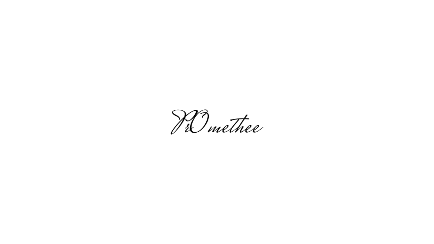

### Hi there 👋

I'm Pr0methee, I'm now a student at the University of Orléans (France ). That's my third year here, I'm pursuing a degree in mathematic, but I chose to have some lessons of Informatic .

For me programming is more a hobby than a project of work.

### My stats

Have a nice day !

<!--
**Pr0methee/Pr0methee** is a ✨ _special_ ✨ repository because its `README.md` (this file) appears on your GitHub profile.
https://github-readme-stats.vercel.app/api/top-langs?username=pr0methee&show_icons=true&locale=en&layout=compact&theme=nightowl&hide_border=true
Here are some ideas to get you started:
](https://github-readme-stats.vercel.app/api/top-langs?username=pr0methee&show_icons=true&locale=en&layout=compact&theme=nightowl&hide_border=true)
- 🔭 I’m currently working on ...
- 🌱 I’m currently learning ...
- 👯 I’m looking to collaborate on ...
- 🤔 I’m looking for help with ...
- 💬 Ask me about ...
- 📫 How to reach me: ...
- 😄 Pronouns: ...
- ⚡ Fun fact: ...
-->
